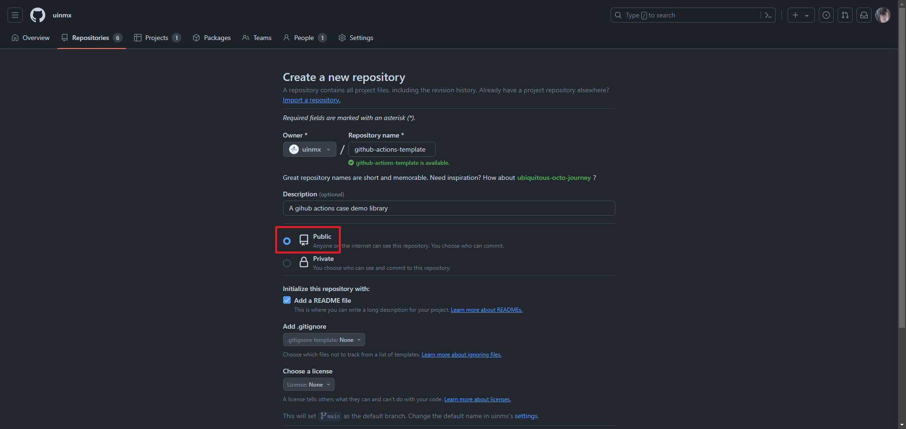
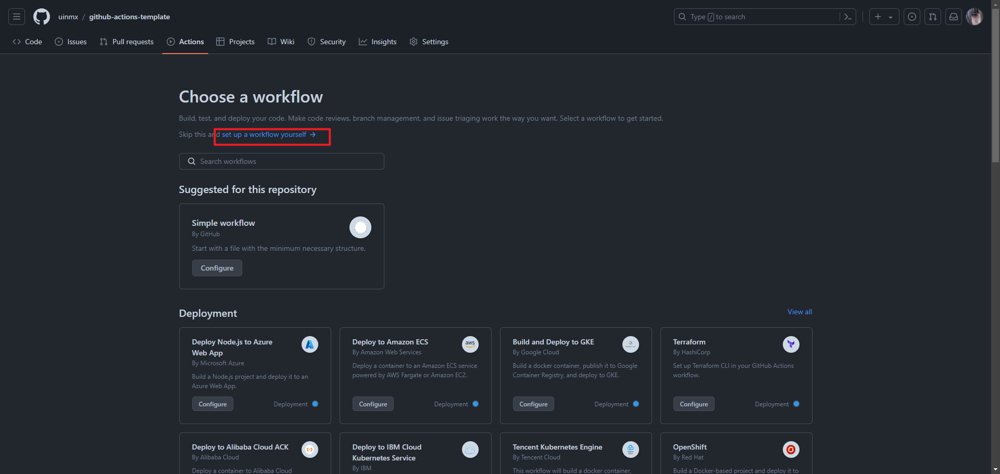
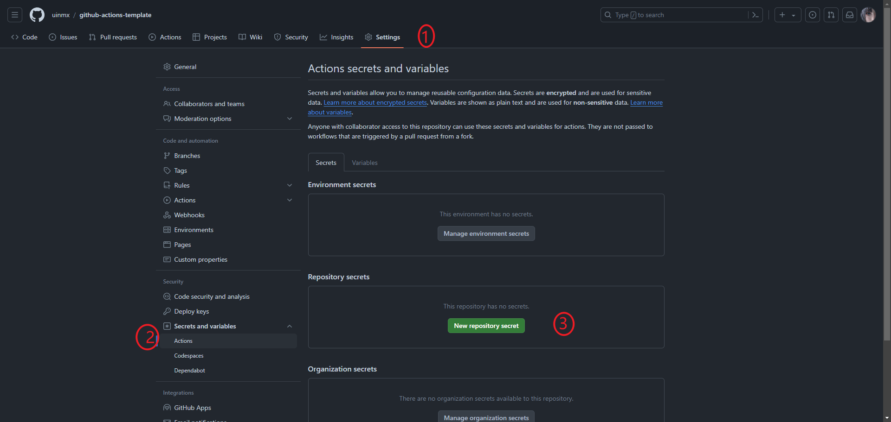
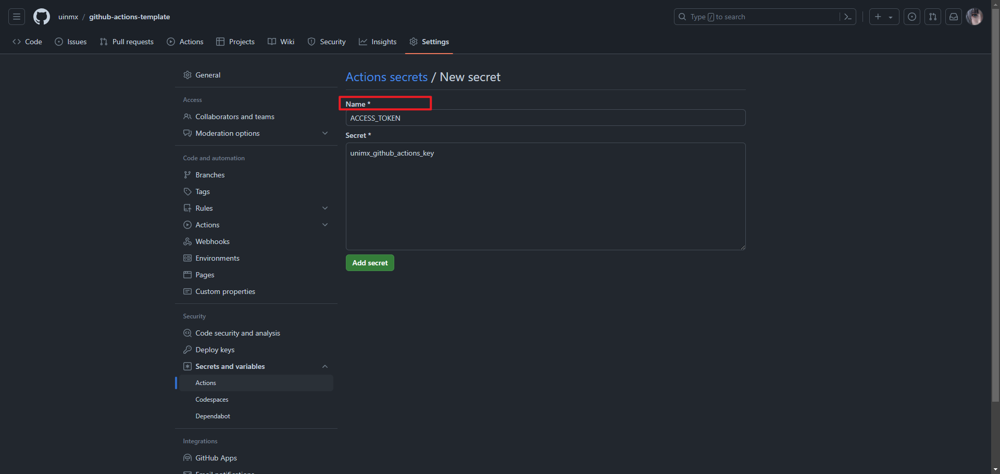
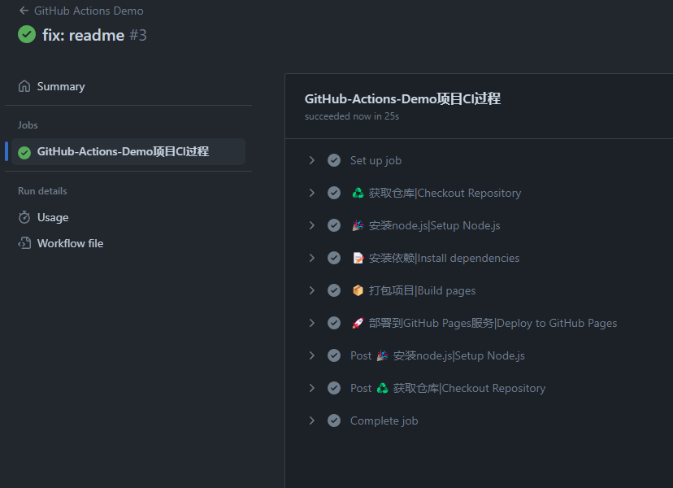
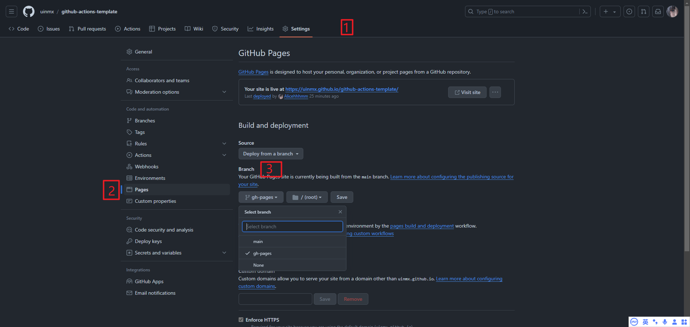

# 如何使用 GitHub Actions自动部署静态网站

## 1.准备内容
1.1 新建一个仓库


1.2 拉取并初始化项目
```bash
npm create vite@latest ./ --template react
```
正常运行后推送项目到仓库

## 2.配置工作流

2.1 添加工作流 workflow 服务



2.2 配置工作流文件
> .github/workflows/main.yml

```bash
name: GitHub Actions Demo

on:
  push:
    branches:
      - main

# 允许仓库写权限
permissions:
  contents: write

# 具体步骤配置
jobs:
  generator-template:
    name: GitHub-Actions-Demo项目CI过程
    runs-on: ubuntu-latest

    steps:
      - name: ♻️ 获取仓库|Checkout Repository
        uses: actions/checkout@v4

      - name: 🎉 安装node.js|Setup Node.js
        uses: actions/setup-node@v3
        with:
          node-version: "20"

      - name: 📝 安装依赖|Install dependencies
        run: npm install

      - name: 📦 打包项目|Build pages
        run: npm run build

      - name: 🚀 部署到GitHub Pages服务|Deploy to GitHub Pages
        if: success()  # 仅在构建成功时部署
        uses: JamesIves/github-pages-deploy-action@releases/v3
        with:
          REPOSITORY_NAME: uinmx/github-actions-template
          ACCESS_TOKEN: ${{ secrets.ACCESS_TOKEN }}
          BRANCH: gh-pages  # 部署到的分支，通常是 gh-pages
          FOLDER: dist # 构建输出的目录
          CLEAN: true  # 自动清理删除的文件
          COMMIT_MESSAGE: 🎉 update from uinmx/github-actions-template

```
2.3 设置密钥


名称必须与 workflows 中的 `ACCESS_TOKEN` 属性内容一致


2.4 push 后工作流运行的效果图


2.5 启动GitHub pages 服务
> 选择`gh-pages`作为服务发布分支并保存



# 参考附录
- [阮一峰 Blog](https://www.ruanyifeng.com/blog/2019/09/getting-started-with-github-actions.html)
- [GitHub Actions Docs](https://docs.github.com/zh/actions/quickstart)
